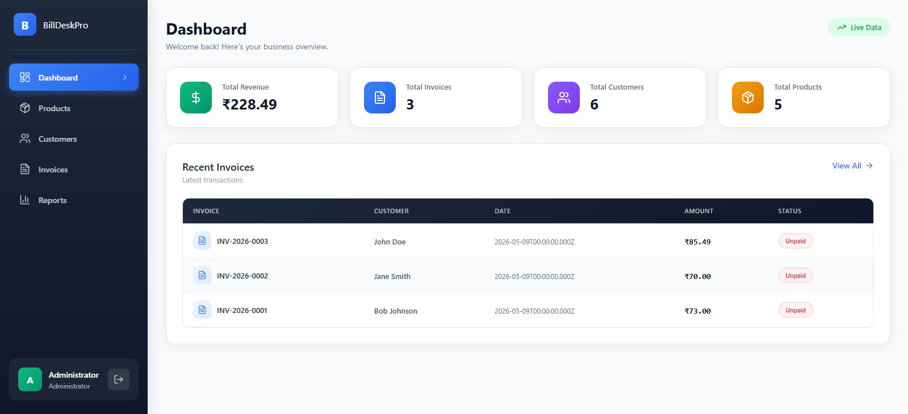
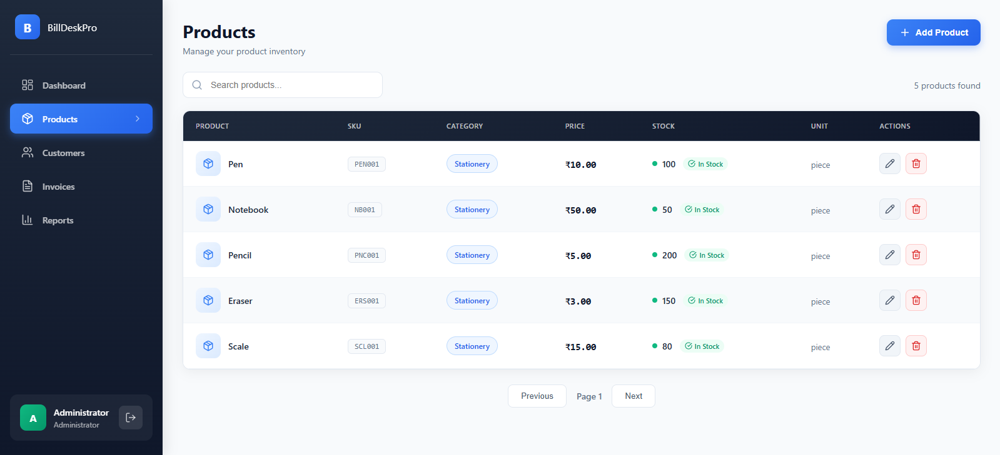

# BillDeskPro - Web-Based Billing System

A complete billing and invoicing solution for small to medium businesses.

## Tech Stack

- **Frontend**: React 18.2.0, React Router v6, Recharts, Lucide Icons
- **Backend**: Node.js, Express.js 4.18.2
- **Database**: MySQL 8.x
- **Authentication**: JWT (JSON Web Tokens)

---

## Technical Requirements

### System Requirements

| Requirement | Version | Description |
|-------------|---------|-------------|
| **Node.js** | 18.x or 20.x LTS | JavaScript runtime |
| **npm** | 9.x or 10.x | Package manager (comes with Node.js) |
| **MySQL** | 8.0+ | Database server |
| **Git** | 2.x | Version control (optional, for cloning) |

### Frontend Dependencies

| Package | Version | Purpose |
|---------|---------|---------|
| react | 18.2.0 | UI framework |
| react-dom | 18.2.0 | React DOM renderer |
| react-router-dom | 6.21.1 | Client-side routing |
| react-scripts | 5.0.1 | Create React App scripts |
| axios | 1.6.2 | HTTP client for API calls |
| recharts | 2.10.3 | Charts and graphs |
| lucide-react | 1.14.0 | Icon library |

### Backend Dependencies

| Package | Version | Purpose |
|---------|---------|---------|
| express | 4.18.2 | Web application framework |
| mysql2 | 3.6.5 | MySQL database driver |
| jsonwebtoken | 9.0.2 | JWT authentication |
| bcryptjs | 2.4.3 | Password hashing |
| cors | 2.8.5 | Cross-origin resource sharing |
| dotenv | 16.3.1 | Environment variable management |
| helmet | 7.1.0 | HTTP security headers |
| express-validator | 7.0.1 | Input validation |

### Development Dependencies

| Package | Version | Purpose |
|---------|---------|---------|
| nodemon | 3.0.2 | Auto-restart server during development |

---

## Local Setup Instructions

### Step 1: Clone the Repository

Open your terminal/command prompt and run:

```bash
git clone https://github.com/BharathKumar-c/BillDeskPro.git
cd BillDeskPro
```

### Step 2: Install Backend Dependencies

```bash
cd server
npm install
```

### Step 3: Configure Backend Environment

Create a `.env` file in the `server` folder with the following content:

```env
NODE_ENV=development
PORT=5000
DB_HOST=localhost
DB_PORT=3306
DB_USER=root
DB_PASSWORD=your_mysql_password
DB_NAME=billdeskpro
DB_FORCE_SSL=false
JWT_SECRET=billdeskpro_secret_key_2026
JWT_EXPIRE=8h
```

**Important:** Replace `your_mysql_password` with your actual MySQL password.

### Step 4: Create Database

Open MySQL using one of the following methods:

**Option A: Command Line**
```bash
mysql -u root -p
CREATE DATABASE billdeskpro;
EXIT;
```

**Option B: MySQL Workbench**
- Open MySQL Workbench
- Create a new schema named `billdeskpro`

**Option C: phpMyAdmin**
- Open phpMyAdmin
- Create a new database named `billdeskpro`

### Step 5: Run Database Migration

Start the backend server:

```bash
cd server
npm start
```

The server will start on `http://localhost:5000`. The database tables will be created automatically when you first access the migration endpoint.

Visit this URL in your browser to create all required tables:
```
http://localhost:5000/api/v1/setup/migrate
```

You should see a success message indicating the tables were created.

### Step 6: Install Frontend Dependencies

Open a new terminal window (keep the backend running):

```bash
cd client
npm install
```

### Step 7: Configure Frontend Environment

Create a `.env` file in the `client` folder with the following content:

```env
REACT_APP_API_URL=http://localhost:5000/api/v1
```

### Step 8: Start the Application

You need to run both backend and frontend:

**Terminal 1 (Backend):**
```bash
cd server
npm start
```

**Terminal 2 (Frontend):**
```bash
cd client
npm start
```

### Step 9: Access the Application

Open your web browser and navigate to:
```
http://localhost:3000
```

---

## Default Login Credentials

| Role | Username | Password | Description |
|------|-----------|----------|-------------|
| **Admin** | admin | admin123 | Full access to all features |
| **Cashier** | cashier | cashier123 | Limited access (sales only) |

---

## Project Structure

```
BillDeskPro/
├── client/                 # React frontend application
│   ├── public/             # Static files
│   ├── src/
│   │   ├── components/     # Reusable UI components
│   │   │   ├── ConfirmModal.js
│   │   │   └── Layout.js
│   │   ├── context/        # React contexts
│   │   │   ├── AuthContext.js
│   │   │   └── ToastContext.js
│   │   ├── pages/          # Page components
│   │   │   ├── Dashboard.js
│   │   │   ├── Products.js
│   │   │   ├── Customers.js
│   │   │   ├── Invoices.js
│   │   │   ├── NewInvoice.js
│   │   │   ├── InvoiceDetail.js
│   │   │   ├── Reports.js
│   │   │   └── Login.js
│   │   ├── utils/          # Utility functions
│   │   │   └── api.js
│   │   ├── App.js          # Main app component
│   │   └── index.js        # Entry point
│   ├── package.json
│   └── .env                # Frontend environment variables
│
├── server/                 # Node.js backend API
│   ├── certs/              # SSL certificates (for production)
│   │   └── aiven-ca.pem
│   ├── config/
│   │   └── db.js           # Database configuration
│   ├── middleware/
│   │   └── auth.js         # JWT authentication middleware
│   ├── routes/
│   │   ├── auth.js         # Authentication routes
│   │   ├── products.js     # Product management routes
│   │   ├── customers.js   # Customer management routes
│   │   ├── invoices.js    # Invoice management routes
│   │   └── setup.js       # Database migration routes
│   ├── index.js            # Express app entry point
│   ├── package.json
│   └── .env                # Backend environment variables
│
├── render.yaml             # Render deployment configuration
└── README.md               # This file
```

---

## Features

### Authentication & Authorization
- JWT-based authentication
- Role-based access control (Admin/Cashier)
- Secure password hashing
- Auto-logout on token expiration

### Product Management
- Add new products
- Edit existing products
- Delete products
- View product list with search
- Track product stock and pricing

### Customer Management
- Add new customers
- Edit customer details
- Delete customers
- View customer list with search
- Track customer purchase history

### Invoice Management
- Create new invoices
- Add multiple products to invoice
- Calculate totals automatically
- Apply discounts
- View invoice history
- Print invoice
- Download invoice as PDF

### Reports & Analytics
- Sales summary dashboard
- Revenue charts
- Product-wise sales analysis
- Customer-wise sales analysis
- Date range filtering
- CSV export for data analysis

---

## Screenshots

### Dashboard


### Products


---

## Deployment

### Deploy to Render (Cloud Hosting)

#### Option 1: Using render.yaml (Recommended)

1. Push your code to GitHub
2. Go to [Render Dashboard](https://dashboard.render.com/)
3. Render will detect `render.yaml` automatically
4. Add environment variables:
   - `DB_HOST` = your database host
   - `DB_PORT` = your database port
   - `DB_USER` = database username
   - `DB_PASSWORD` = database password
   - `DB_NAME` = database name
   - `DB_FORCE_SSL` = true (for Aiven/Cloud MySQL)
   - `JWT_SECRET` = your secret key
   - `JWT_EXPIRE` = 8h
5. Deploy will start automatically

#### Option 2: Manual Deployment

**Backend:**
1. Create a new Web Service on Render
2. Connect GitHub repository
3. Set root directory to `server`
4. Build Command: `npm install`
5. Start Command: `npm start`
6. Add all environment variables

**Frontend:**
1. Create a new Static Site on Render
2. Connect GitHub repository
3. Set root directory to `client`
4. Build Command: `npm install && npm run build`
5. Publish Directory: `build`
6. Add environment variable: `REACT_APP_API_URL`

---

## Troubleshooting

### Port Already in Use

**Windows:**
```bash
netstat -ano | findstr :5000
taskkill /PID <PID> /F
```

**Mac/Linux:**
```bash
lsof -i :5000
kill -9 <PID>
```

### MySQL Connection Failed

- Ensure MySQL server is running
- Verify username and password in `.env`
- Check that database `billdeskpro` exists
- Ensure MySQL allows local connections

### CORS Errors

- Verify backend is running on port 5000
- Check `REACT_APP_API_URL` in client `.env`
- Ensure URL has `/api/v1` suffix

### SSL/TLS Errors (Production)

- If using cloud MySQL (Aiven, AWS, etc.), ensure `DB_FORCE_SSL=true`
- Download and place the CA certificate in `server/certs/`

---

## API Endpoints

| Method | Endpoint | Description | Auth Required |
|--------|----------|-------------|---------------|
| POST | /api/v1/auth/login | User login | No |
| GET | /api/v1/products | List all products | Yes |
| POST | /api/v1/products | Create product | Yes |
| PUT | /api/v1/products/:id | Update product | Yes |
| DELETE | /api/v1/products/:id | Delete product | Yes |
| GET | /api/v1/customers | List all customers | Yes |
| POST | /api/v1/customers | Create customer | Yes |
| PUT | /api/v1/customers/:id | Update customer | Yes |
| DELETE | /api/v1/customers/:id | Delete customer | Yes |
| GET | /api/v1/invoices | List all invoices | Yes |
| POST | /api/v1/invoices | Create invoice | Yes |
| GET | /api/v1/invoices/:id | Get invoice details | Yes |
| GET | /api/v1/reports/sales | Get sales report | Yes |
| GET | /api/v1/reports/export | Export CSV | Yes |

---

## License

This project is for educational and commercial use.

---

## Support

For issues or questions, please create an issue on GitHub.
